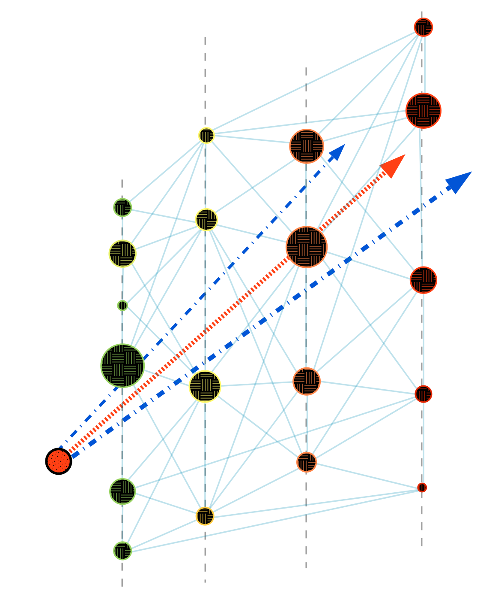

### Hi there 👋

<!--
**ssarkarbht/ssarkarbht** is a ✨ _special_ ✨ repository because its `README.md` (this file) appears on your GitHub profile.

Here are some ideas to get you started:

- 🔭 I’m currently working on ...
- 🌱 I’m currently learning ...
- 👯 I’m looking to collaborate on ...
- 🤔 I’m looking for help with ...
- 💬 Ask me about ...
- 📫 How to reach me: ...
- 😄 Pronouns: ...
- ⚡ Fun fact: ...

-->
# Welcome to my GitHub profile ...

---
> - **Introduction:** I am currently a graduate researcher working in neutrino physics data analytics with [IceCube Neutrino Experiment](https://github.com/icecube).
> - **Current Research:** My current research primarily focuses on developing new physics simulations of neutrino trident interactions ([click here](https://pic-pac.cap.ca/index.php/Issues/showpdf/article/v75n1.0-a4075.pdf) for more details) and building trident event search analysis framework for IceCube data using feature engineering and deep learning classifier.
> - **Pronouns:** He/Him
> - **Email:** souraviiser@gmail.com

---

# Profile Content

---
- PhD Research Projects
	- Event Classification using Graph Convolutional Neural Network
	- Neutrino Trident Monte Carlo Event Generator
- Academic Works
	
---

## Machine Learning Application in PhD Thesis

**Event Classification using Graph Convolutional Neural Network (GCN):**  

[comment]: <> ()
