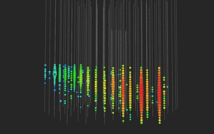
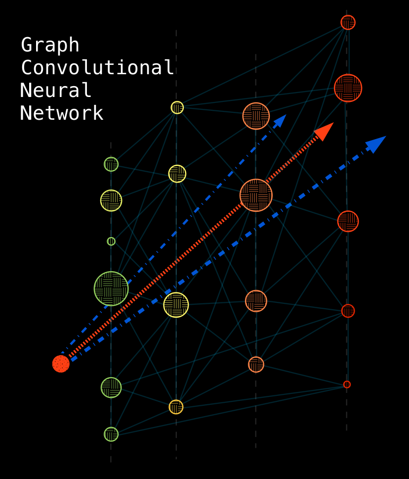

### Hi there 👋

<!--
**ssarkarbht/ssarkarbht** is a ✨ _special_ ✨ repository because its `README.md` (this file) appears on your GitHub profile.

Here are some ideas to get you started:

- 🔭 I’m currently working on ...
- 🌱 I’m currently learning ...
- 👯 I’m looking to collaborate on ...
- 🤔 I’m looking for help with ...
- 💬 Ask me about ...
- 📫 How to reach me: ...
- 😄 Pronouns: ...
- ⚡ Fun fact: ...

-->
# Welcome to my GitHub profile ...

---
> - **Introduction:** I am currently a postdoctoral fellow working in neutrino physics data analytics with [IceCube Neutrino Experiment](https://github.com/icecube).
> - **Current Research:** My current research primarily focuses on developing physics simulations of neutrino-induced dimuon interactions ([click here](https://pic-pac.cap.ca/index.php/Issues/showpdf/article/v75n1.0-a4075.pdf) for more details) and building dimuon search analysis framework for IceCube data using feature engineering and deep learning classifier.
> - **Pronouns:** He/Him
> - **Email:** souraviiser@gmail.com

---

# Profile Content

---
- PhD Research Projects
	- Event Classification using Graph Convolutional Neural Network ([github repo](https://github.com/ssarkarbht/TridentGNNClassifier))
	- Neutrino Dimuon Monte Carlo Event Generator ([github repo](https://github.com/ssarkarbht/NuDimuon-Generator))
- Academic Works
	- Poster presentation at Weak Interactions and Neutrinos (WIN) 2021 conference ([link](https://github.com/ssarkarbht/AcademicWorks/blob/master/WIN_2021_Poster.pdf))
	- Literature review on Markov Chain Monte Carlo (MCMC) and Optimization ([link](https://github.com/ssarkarbht/AcademicWorks/blob/master/MCMCOptimization.pdf))
	- Monte Carlo simulation of neutrino beam at T2K experiment ([link](https://github.com/ssarkarbht/AcademicWorks/blob/master/NeutrinoBeamSimulation.pdf))
---

## Summary of the Pattern Recognition Problem in Neutrino Dimuon Research Project

One of the major event topologies in the IceCube detector is called a "track-like" event, generated by the Cherenkov radiation (bluish light) from high energy muons passing through the detector volume. More than 5000 embedded light sensors in the detector called digital optical modules (DOM) detect the light from the Cherenkov radiation and register timestamps and the amount of light seen in the form of charges. As the DOMs are placed permanently in the detector in 3D lattice structure, the raw data from the IceCube detector consists of spatiotemporal information and the amount of light seen by each DOM. This is the visualization of an example track-like event seen in the detector (image credit: IceCube/NSF):

For more on the visualization of the IceCube events in video animation, watch [this YouTube link](https://www.youtube.com/watch?v=2DDQYHIbL3Q&ab_channel=IceCubeNeutrinoObservatory).

For neutrino trident and charm production interactions, we expect two muons (instead of one muon in the standard IceCube 'track-like' event) to travel very close to each other (we call it a 'dimuon' event). The challenging aspect of seeing dimuon events is that the light signature from these events looks very similar to a single muon track-like event. Due to the limited detector resolution, the standard likelihood statistical analysis to reconstruct track events is unable to detect these double-muon events from neutrino trident interactions. In my research project, I address this problem by exploiting the difference in the geometric patterns from the Cherenkov light emission profiles between single-muon and double-muon events. We then use the findings as input features for a machine learning **event classification using Graph Convolutional Neural Network (GCN):** [GitHub Repo](https://github.com/ssarkarbht/TridentGNNClassifier). The following diagram is a simplified visualization of the GCN model. The spherical blobs represent the DOMs detecting light where the colour of the blobs represents the time information (green is earlier and red is later detected light) and the size of the blobs represents the amount of detected light:

